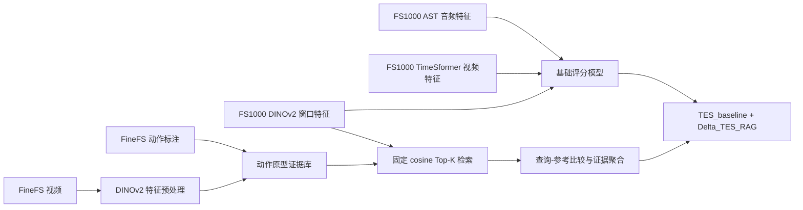

# 基于动作证据检索的花样滑冰 TES 评分项目

> 本文用于组会汇报。目标是先用直观语言说明项目为什么这样设计，再给出与当前代码一致的数据流、公式、训练方式、实验边界和当前进度。

## 1. 一句话概括

本项目先用 FS1000 上的音频、动态视频和静态视觉特征预测一个基础 TES，再从带动作级标注的 FineFS 中检索相似动作作为外部证据，最后只让检索证据对基础 TES 做一个有界修正：

$$
\widehat{TES}_{final}
=
\widehat{TES}_{baseline}
+
\Delta TES_{RAG}.
$$

这里的 RAG 不是“大模型查文本”，而是“当前视频片段查找相似的已评分动作”。它也不是直接复制参考动作的分数，而是学习当前动作相对参考动作应该更好还是更差。

## 2. 研究问题

### 2.1 要预测什么

花样滑冰总分中包含不同部分。本项目当前只预测 **TES（Technical Element Score，技术动作分）**，不把 PCS 作为训练目标。

FS1000 提供整段节目级别的 TES，但不提供每个跳跃、旋转或步法序列在视频中的精确位置。FineFS 则提供动作时间区间、动作名称和裁判信息。因此两个数据集承担不同角色：

| 数据集 | 当前用途 | 可用监督 |
|---|---|---|
| FS1000 | 待评分视频、训练集和验证集 | 整段视频的 TES |
| FineFS | 外部动作证据库 | 动作区间、动作名称、BV、裁判 GOE、panel score |

### 2.2 为什么基础模型之外还要检索

纯回归模型把所有评分知识压进参数中。例如，模型看到一个三周跳，只能依靠训练中形成的隐式记忆判断质量。

检索模型则多了一步：

1. 找到视觉上相近的已评分动作；
2. 读取这些动作的类型、基础分和裁判评价；
3. 比较当前动作与参考动作；
4. 判断基础 TES 应该上调还是下调。

直观类比是：基础模型像裁判凭经验直接打分，RAG 模块像裁判在赛后复核时调出几个相似动作进行对照。

### 2.3 核心假设

项目要验证的不是“增加一个更大的网络是否有效”，而是下面这个更具体的假设：

> 在固定基础评分模型的情况下，来自独立带标签动作库的相似动作证据，能否提供稳定、可追溯且具有增量价值的 TES 修正？

因此，RAG 阶段冻结基础模型，只训练证据分支。这样最终提升更容易归因于检索证据，而不是基础模型同时发生了变化。

## 3. 术语与分数含义

这些量容易混淆，汇报时应明确区分。

| 名称 | 含义 | 当前代码中的用途 |
|---|---|---|
| TES | 整段节目的技术动作总分 | 最终预测目标 |
| BV | 某个动作的基础分值 | FineFS 参考证据 |
| GOE grade | 裁判给出的动作执行等级，通常在 -5 到 +5 | FineFS 参考证据与相对质量建模 |
| GOE points | 按动作规则换算后的加减分值 | 保存在 corpus 元数据中，但当前证据网络主要使用 GOE grade |
| panel score | FineFS 标注中的动作 panel 分数 | FineFS 参考证据 |
| cosine similarity | 当前窗口与参考动作在 DINO 特征空间中的相似度 | 只表示视觉相似，不等于评分相似 |
| citation weight | 证据网络对某个候选参考动作分配的权重 | 用于证据聚合和结果解释 |

FineFS 中的参考 GOE grade 由多个裁判分数计算：先删去一个最高分和一个最低分，再对其余裁判分数求平均。它不是 GOE points。

## 4. 整体数据流



整个系统可以分成四层：

1. **基础评分层**：预测没有 RAG 时的 TES；
2. **证据库层**：把 FineFS 动作转成可检索原型；
3. **固定检索层**：为 FS1000 每个窗口离线保存 Top-K 候选；
4. **证据修正层**：比较查询与参考，输出 TES 残差。

## 5. 基础评分模型

命令行中的阶段名仍叫 `dynamic`，但当前基础模型实际上同时使用动态音视频特征和 FS1000 DINO 静态特征。为了避免歧义，本文统一称它为 **baseline**。

### 5.1 动态音视频输入

对第 $t$ 个时间段：

- AST 音频特征为 $A_t\in\mathbb{R}^{1\times768}$；
- TimeSformer 视频特征为 $V_t\in\mathbb{R}^{15\times768}$。

它们沿 token 维拼接：

$$
X_t=[A_t;V_t]\in\mathbb{R}^{16\times768}.
$$

线性层把每个 token 从 768 维投影到 512 维，再送入 MRU（Memory Recurrent Unit）。MRU 同时维护记忆 token 和 CLS token，使当前时间段能够利用前面时间段的信息。

### 5.2 双向 MRU

正向 MRU 从节目开头处理到结尾，反向 MRU 在反转后的序列上处理。记正向和反向的 CLS 输出为 $C_t^{f}$ 与 $C_t^{b}$，对齐后的动态表示为：

$$
D_t=\frac{C_t^{f}+C_t^{b}}{2},
\qquad D_t\in\mathbb{R}^{512}.
$$

变长 batch 中的 padding 不参与最终均值。当前实现按每个样本的真实长度单独翻转反向输出，避免把 padding 位置误当成有效时刻。

### 5.3 DINOv2 静态表示

DINOv2 ViT-L/14 对一个视频采样窗口输出 CLS token 和所有 patch token。代码把 CLS 与 patch 均值拼接：

$$
Z_t=
\left[
z_t^{CLS};
\frac{1}{N}\sum_{i=1}^{N}z_{t,i}^{patch}
\right]
\in\mathbb{R}^{2048}.
$$

这样既保留全局语义，也保留局部区域的平均信息。

对 FS1000，DINO 窗口数量与动态序列长度保持一致；`.times.npy` 侧文件保存窗口起止时间和实际采样起止时间。已有 DINO 特征数组不会被时间侧文件覆盖。

### 5.4 基础 TES 公式

与 `checkpoint_epoch42_loss112.53_spear0.879.pth` 的参数结构一致，静态投影为：

$$
S_t=W_sZ_t+b_s,
\qquad W_s\in\mathbb{R}^{512\times2048}.
$$

随后拼接动态表示和静态表示：

$$
U_t=[D_t;S_t]\in\mathbb{R}^{1024}.
$$

逐时刻评分头为：

$$
p_t=W_2\,Dropout\left(GELU\left(W_1\,LN(U_t)+b_1\right)\right)+b_2,
$$

其中 $W_1:1024\rightarrow256$，$W_2:256\rightarrow1$。

整段视频的基础 TES 是有效时间段分数的 masked mean：

$$
\widehat{TES}_{baseline}
=
\frac{\sum_{t=1}^{T}m_t p_t}
{\max\left(1,\sum_{t=1}^{T}m_t\right)},
$$

$m_t=1$ 表示有效窗口，$m_t=0$ 表示 padding。

## 6. FineFS 动作证据库

### 6.1 为什么不能直接用 FineFS 自带的旧特征

FineFS 原有缓存是 1024 维，而 FS1000 DINO 查询是 2048 维。不同特征空间不能直接计算有意义的 cosine similarity。因此项目用同一个 DINOv2 提取器重新处理 FineFS，得到 2048 维特征。

当前 FineFS 共有 1167 个视频，标注中约有 10,359 个动作。DINO 缓存已经生成 1167 组“特征文件 + 时间侧文件”。

### 6.2 从动作区间生成原型

FineFS 给出动作时间区间 $[a_{start},a_{end}]$。对每个动作：

1. 找到与动作区间有时间重叠的 DINO 窗口；
2. 如果没有窗口重叠，选择中心时刻最近的窗口；
3. 把候选窗口按时间切成若干组；
4. 每组求均值，得到多个动作原型。

不同动作允许的原型上限为：

| 粗粒度类型 | 最大原型数 |
|---|---:|
| jump | 3 |
| spin | 4 |
| sequence | 8 |
| unknown | 4 |

步法序列通常持续更久，因此允许更多原型。每个视频还最多抽取 3 个不与动作区间重叠的 background 原型；background 可帮助判断检索是否落在非动作区域，但它没有有效评分标签。

### 6.3 每条 corpus 记录包含什么

每个原型至少包含：

- 归一化后的 2048 维 DINO key；
- FineFS `video_id` 和动作 `instance_id`；
- 动作名称和粗粒度类型；
- GOE grade、GOE points、BV、panel score；
- 原型在该动作中的编号；
- `valid_score_mask`。

只有 GOE grade、BV 和 panel score 都是有限数值时，`valid_score_mask=True`。背景原型固定为 `False`，不能贡献评分修正。

## 7. 防止数据泄漏

这是整个实验最需要严谨说明的部分。

### 7.1 为什么存在潜在泄漏

FS1000 与 FineFS 可能收录同一场节目。如果验证视频本身也出现在参考库中，检索可能找到自己的动作，结果就不再代表泛化能力。

两个数据集没有可靠的统一视频 ID，因此不能根据文件名强行对应。项目只使用由以下八项组成的节目分数签名进行保守匹配：

$$
signature=(TES,PCS_f,SS,TR,PE,CO,IN,factor).
$$

其中 $PCS_f$ 是 factored PCS，其余是五项节目内容分和系数。

### 7.2 当前规则

1. 如果 FineFS 视频的签名与 FS1000 验证集唯一匹配，该 FineFS 视频完全不进入 corpus；
2. 如果 FS1000 训练查询与某个 FineFS 视频唯一匹配，为该查询生成候选时排除这个 FineFS 视频；
3. 非唯一匹配不进行猜测；
4. 不根据文件排序、节目时长或相似文件名建立映射。

内部审计中，811 个 FS1000 样本里有 214 个获得唯一签名匹配，597 个无法可靠匹配，没有把不确定映射当成真值。

### 7.3 为什么不迁移动作时间戳

即便分数签名一致，两个数据源的视频也可能存在开头、结尾或剪辑差异。已匹配视频的时长差并不稳定，因此 FineFS 的局部动作时间戳不能直接当成 FS1000 查询的动作监督。

所以当前方法是 **视频级弱监督 RAG**：

- FineFS 时间戳只用于构建参考动作；
- FS1000 只用整段 TES 监督最终残差；
- 不声称模型拥有 FS1000 的动作级真值。

## 8. 固定 Top-K 检索

### 8.1 相似度

对 FS1000 第 $t$ 个 DINO 查询 $q_t$ 和 corpus 第 $i$ 个 key $k_i$ 做 L2 归一化：

$$
\bar q_t=\frac{q_t}{\|q_t\|_2},
\qquad
\bar k_i=\frac{k_i}{\|k_i\|_2}.
$$

cosine similarity 为：

$$
s_{t,i}=\bar q_t^T\bar k_i.
$$

过滤同源视频后，保存相似度最高的 $K$ 个候选。默认 $K=8$。

### 8.2 为什么离线保存候选

候选索引和相似度保存在每个 FS1000 样本对应的 `.npz` 中，形状为 $[T,K]$。这样做有三个好处：

1. 每个 epoch 使用完全相同的候选，实验可复现；
2. 训练不会偷偷改变检索器；
3. 可以把“检索质量”和“证据聚合能力”分开分析。

候选还会按 `instance_id` 去重，避免同一个动作的多个相邻原型占满 Top-K。

## 9. 时间对齐

基础模型的动态窗口与 DINO 实际采样窗口不一定严格相同。项目使用时间重叠长度构造对齐矩阵：

$$
\omega_{t,j}
=
\max\left(
0,
\min(e_t^{static},e_j^{dynamic})
-
\max(b_t^{static},b_j^{dynamic})
\right).
$$

其中 $b$ 和 $e$ 分别表示开始和结束时间。

第 $t$ 个 DINO 查询对应的动态上下文为：

$$
\widetilde D_t
=
\frac{\sum_j\omega_{t,j}D_j}
{\max\left(\epsilon,\sum_j\omega_{t,j}\right)}.
$$

直观上，一个 2 秒 DINO 采样窗口如果跨越两个动态片段，就按真实重叠时长融合这两个动态表示，而不是硬选一个索引。

## 10. 查询与参考证据编码

### 10.1 查询 token

查询编码器同时接收当前 DINO 表示和对齐后的动态上下文：

$$
Q_t=f_q([Z_t;\widetilde D_t]).
$$

### 10.2 参考 token

第 $k$ 个参考动作包含视觉 key、动作类别 embedding、动作名称 embedding 和数值证据：

$$
R_{t,k}
=f_r([
k_{t,k};
e_{coarse};
e_{element};
g^{ref}/5;
BV/15;
panel/20;
s_{t,k}
]).
$$

除数只用于把数值缩放到较稳定的范围，不代表规则中的固定上限。

### 10.3 成对比较

不能只看参考动作，也不能只看查询动作，因此构造显式差异和逐维乘积：

$$
P_{t,k}
=f_p([
|Q_t-R_{t,k}|;
Q_t\odot R_{t,k};
numeric_{t,k}
]).
$$

$|Q-R|$ 描述“哪里不同”，$Q\odot R$ 描述“哪里一致”。

## 11. 引用权重与相对 GOE

### 11.1 引用权重

每个候选先得到一个 logit：

$$
\ell_{t,k}=f_{cite}(P_{t,k}).
$$

只在有效候选上做 masked softmax：

$$
\alpha_{t,k}
=
\frac{\exp(\ell_{t,k})m_{t,k}}
{\sum_r\exp(\ell_{t,r})m_{t,r}}.
$$

然后再用 `valid_score_mask` 过滤没有评分证据的候选：

$$
w_{t,k}=\alpha_{t,k}v_{t,k},
\qquad
\rho_t=\sum_k w_{t,k}.
$$

$\rho_t$ 是该窗口实际拥有多少“可评分证据”的置信量。

### 11.2 不直接复制参考 GOE

模型预测当前动作相对参考动作的 GOE grade 差：

$$
\Delta g_{t,k}=5\tanh(f_{goe}(P_{t,k})).
$$

候选对当前动作的 GOE 判断为：

$$
g_{t,k}^{query}=g_k^{ref}+\Delta g_{t,k}.
$$

窗口级 GOE 证据为：

$$
\widehat g_t
=
\frac{\sum_k w_{t,k}g_{t,k}^{query}}
{\max(\epsilon,\rho_t)}.
$$

例如，参考动作 GOE grade 为 $+2.0$，但当前动作落冰更不稳定，模型可预测 $\Delta g=-1.3$，于是该参考给出的当前动作判断是 $+0.7$，而不是机械复制 $+2.0$。

## 12. 从局部证据到 TES 修正

每个查询窗口先聚合候选 pair token、相对 GOE 和相似度，得到局部证据 $E_t$。整段视频再同时做 masked mean 和 masked max：

$$
E_{mean}=MaskedMean_t(E_t),
\qquad
E_{max}=MaskedMax_t(E_t).
$$

mean 描述整场节目的总体证据，max 保留少数关键动作产生的强证据。

代码还构造 9 个检索统计量：

1. 有效评分证据置信量的均值；
2. 有效评分证据置信量的最大值；
3. Top-1 cosine similarity 的均值；
4. Top-1 cosine similarity 的最大值；
5. Top-1 与 Top-2 similarity margin 的均值；
6. citation weight 的归一化熵均值；
7. 预测 GOE grade 的均值；
8. 预测 GOE grade 的标准差；
9. 具有有效评分证据的窗口比例。

最终修正为：

$$
r=f_{corr}([E_{mean};E_{max};statistics]),
$$

$$
\Delta TES_{RAG}
=
\Delta_{max}\tanh(r),
\qquad \Delta_{max}=20.
$$

如果整段视频没有任何带有效评分的参考动作，则强制：

$$
\Delta TES_{RAG}=0.
$$

修正头不直接接收基础 TES 标量，也不直接接收全局动态表示。它只能通过查询与参考的局部比较形成修正，降低把 RAG 分支退化成第二个普通回归头的风险。

## 13. 一个完整的直观例子

假设基础模型对一段节目预测：

$$
\widehat{TES}_{baseline}=80.2.
$$

节目某个窗口检索到三个有效参考：

| 参考 | 动作 | cosine | 参考 GOE grade | 模型预测相对差 |
|---|---|---:|---:|---:|
| A | 3Lz+3T | 0.91 | +1.8 | -0.8 |
| B | 3Lz+3T | 0.88 | +0.5 | +0.2 |
| C | 3F+2T | 0.82 | +1.0 | -0.3 |

相对比较后，这三个参考对当前动作的 GOE 判断分别是 $+1.0$、$+0.7$ 和 $+0.7$。citation head 可能认为 A 和 B 更可信，而 C 的动作类型略有差异，因此给 C 更低权重。

整场所有窗口聚合后，correction head 输出：

$$
\Delta TES_{RAG}=+1.6.
$$

最终：

$$
\widehat{TES}_{final}=80.2+1.6=81.8.
$$

这里的 $+1.6$ 不是某个参考动作的 GOE points，也不是参考视频 TES，而是所有局部证据共同支持的整场 TES 残差。

## 14. 两阶段训练

### 14.1 Baseline 阶段

训练命令中的阶段名是 `dynamic`。损失为 TES 均方误差：

$$
\mathcal L_{baseline}
=
\frac{1}{B}\sum_{n=1}^{B}
(\widehat{TES}_{baseline,n}-TES_n)^2.
$$

加载旧 checkpoint 时使用严格参数加载。训练前先执行一次验证并记录为 `epoch=-1`，用于确认 checkpoint、代码、数据划分和缓存是否真正匹配。

### 14.2 RAG 阶段

1. 加载 baseline checkpoint；
2. 冻结 MRU、静态投影和基础评分头；
3. 将基础模型保持在 `eval()`，避免 Dropout 引入随机波动；
4. 只把 RAG 模块设为训练状态；
5. 只更新 RAG 参数。

RAG 损失为：

$$
\mathcal L_{RAG}
=
MSE(\widehat{TES}_{final},TES)
+
\lambda\frac{1}{B}\sum_n(\Delta TES_{RAG,n})^2,
$$

默认 $\lambda=10^{-4}$。第二项限制不必要的大幅修正。

correction head 最后一层使用零初始化，因此 RAG 训练开始时严格满足：

$$
\widehat{TES}_{final}=\widehat{TES}_{baseline}.
$$

这使训练从“无害的零修正”开始，而不是一开始用随机残差破坏基础分数。

## 15. 评价指标与 checkpoint

当前记录三个指标：

$$
MSE=\frac{1}{N}\sum_i(\hat y_i-y_i)^2,
$$

$$
MAE=\frac{1}{N}\sum_i|\hat y_i-y_i|,
$$

$$
Spearman=Corr(rank(\hat y),rank(y)).
$$

- MSE 对大误差惩罚更重；
- MAE 更容易解释为“平均差多少分”；
- Spearman 评价节目排序是否正确。

best checkpoint 按验证集 Spearman 最大值选择，文件名包含时间、epoch、验证 loss 和 Spearman，例如：

```text
dynamic_seed2026_20260722_120000_best_epoch012_loss64.7400_spear0.8710.pth
```

评估 RAG checkpoint 时，必须同时报告：

1. 完整 RAG 的最终指标；
2. 同一个 checkpoint 关闭残差后的 baseline-only 指标；
3. $\Delta TES$ 的均值、标准差和有效证据比例；
4. 每个样本的主要引用动作。

## 16. 当前已实现的实验控制

### 16.1 已实现

- 固定 FS1000 的 `train_fs800.txt` 和 `val_fs800.txt`；
- 验证同源 FineFS 视频从 corpus 排除；
- 训练查询的同源 FineFS 视频按查询排除；
- 固定离线 Top-K；
- corpus tensor 冻结且不重复存入 checkpoint；
- RAG 阶段冻结 baseline；
- correction 零初始化；
- 无评分证据时残差硬置零；
- 同一 RAG checkpoint 的 baseline-only 对照；
- 导出可追溯引用和检索统计量。

### 16.2 论文中仍应补充的消融

下面这些实验是建议项，当前主脚本尚未全部实现，汇报时不能说已经完成：

- cosine Top-K 与随机候选对比；
- 正确参考分数与打乱参考分数对比；
- 有 BV/GOE/panel 与只用视觉 key 对比；
- 不同 $K$ 值对比；
- 去掉相对 GOE head 的对比；
- 去掉泄漏排除规则后的诊断结果，但该结果只能用于说明泄漏影响，不能作为主结果。

如果打乱参考分数后性能几乎不变，说明模型没有真正利用评分证据；如果随机候选也同样有效，说明提升更可能来自额外参数，而不是检索。

## 17. 当前进度与必须说明的问题

### 17.1 已完成

- FineFS 1167 个视频的 DINO 特征和时间侧文件已经全部生成；
- FS1000 的 DINO 特征保留不变，时间侧文件已生成；
- baseline、corpus builder、候选预计算、RAG、训练和评估入口已经实现；
- 6 个合成单元测试通过，其中包含 batch 内音频/视频交叉变长的回归测试；
- 0.879 checkpoint 的 42 个参数已能严格加载；
- 原始 Git HEAD 模型与当前重构模型逐样本 A/B 的最大输出差约为 $7.6\times10^{-6}$。
- 当前重新训练得到的 baseline best checkpoint 为 epoch 13，验证集约为
  `MSE=121.1647, Spearman=0.8507`；
- 使用该 baseline checkpoint 的真实 RAG 单 batch 训练、验证和保存流程已经通过。

### 17.2 checkpoint 复现差异

文件：

```text
checkpoint_epoch42_loss112.53_spear0.879.pth
```

其参数结构已经核对为：

```text
static_proj: 2048 -> 512
time_score_mlp: LayerNorm(1024) -> Linear(1024,256)
                -> GELU -> Dropout -> Linear(256,1)
```

但在当前 FS1000 验证集和缓存上，严格加载后实测约为：

```text
MSE      = 295.0
MAE      = 14.89
Spearman = 0.559
```

这与文件名中的 `loss=112.53, spear=0.879` 不一致。因为原始 HEAD 与当前模型输出一致，所以目前不能把差异归因于 RAG 重构代码。更可能需要核对：

- checkpoint 当时使用的 `train_fs800.txt` / `val_fs800.txt` 哈希；
- 当时使用的 DINO 缓存版本和提取参数；
- checkpoint 是否被重命名；
- 对应训练日志中的真实 epoch、loss 和 Spearman；
- 当时是否使用了另一套验证数据或预处理结果。

在版本来源确认之前，组会上应把 0.879 称为“checkpoint 文件名记录值”，不能称为“当前代码已复现结果”。

### 17.3 当前产物状态

代码恢复后，下面两类产物已经重新构建并能被真实 RAG 训练读取：

- `rag_artifacts/action_rag_corpus.pt`；
- `rag_artifacts/candidates/` 下每个 FS1000 查询对应的 candidate `.npz`。

FineFS 的 1167 组 DINO 特征和时间侧文件也完整保留，不需要重新提取。

## 18. 代码文件对应关系

| 文件 | 作用 |
|---|---|
| `action.py` | FS1000/FineFS DINOv2 预处理与时间侧文件 |
| `model.py` | baseline、双向 MRU 和最终 TES 组合 |
| `action_rag.py` | 查询/参考编码、citation、相对 GOE、证据聚合和残差 |
| `dataset/dataset_fs800.py` | 数据加载、padding、候选加载与时间重叠矩阵 |
| `scripts/build_action_rag_corpus.py` | 从 FineFS 动作标注构建 corpus |
| `scripts/precompute_action_candidates.py` | 固定 Top-K 候选预计算 |
| `scripts/audit_action_retrieval.py` | corpus 内 leave-video-out 检索审计 |
| `main.py` | baseline/RAG 两阶段训练与指标记录 |
| `eval.py` | 最终评估、baseline-only 对照和引用导出 |
| `scripts/run_action_rag.sh` | 统一运行入口 |

## 19. 当前运行顺序

环境保持不变：

- DINO 预处理：`/home/v100/anaconda3/envs/skating-dinov2`；
- 训练与评估：`/home/v100/anaconda3/envs/skating-action`。

先检查代码：

```bash
cd /home/v100/ZYQ/skating
bash scripts/run_action_rag.sh test
```

FineFS DINO 已完成，但统一脚本可以安全断点续跑并跳过已有文件。重建 corpus 和 candidates 可直接执行：

```bash
cd /home/v100/ZYQ/skating
bash scripts/run_action_rag.sh build-corpus
bash scripts/run_action_rag.sh audit-retrieval
bash scripts/run_action_rag.sh candidates
```

baseline checkpoint 的版本来源核对清楚后再训练 baseline：

```bash
cd /home/v100/ZYQ/skating
bash scripts/run_action_rag.sh train-dynamic
```

然后训练 RAG：

```bash
cd /home/v100/ZYQ/skating
DYNAMIC_CHECKPOINT=/absolute/path/to/dynamic_best.pth \
  bash scripts/run_action_rag.sh train-rag
```

评估完整 RAG 和同 checkpoint 的 baseline-only 对照：

```bash
cd /home/v100/ZYQ/skating
CHECKPOINT=/absolute/path/to/rag_best.pth \
  bash scripts/run_action_rag.sh evaluate

CHECKPOINT=/absolute/path/to/rag_best.pth \
  bash scripts/run_action_rag.sh evaluate-baseline
```

## 20. 建议的组会讲述顺序

如果汇报时间约 12 分钟，可以按下面顺序：

1. **1 分钟：问题**。为什么只有视频级 TES 时，动作级评分知识没有被充分利用；
2. **2 分钟：基础模型**。AST + TimeSformer + 双向 MRU + DINO，解释 baseline 公式；
3. **2 分钟：FineFS 证据库**。动作区间如何变成可检索原型；
4. **2 分钟：检索与对齐**。cosine Top-K 和时间重叠矩阵；
5. **2 分钟：证据修正**。citation、相对 GOE 和有界 TES 残差；
6. **1 分钟：防泄漏**。验证同源排除和为什么不迁移时间戳；
7. **1 分钟：实验设计**。baseline-only、完整 RAG 和关键消融；
8. **1 分钟：当前状态**。预处理完成、产物需重建、0.879 复现差异仍待定位。

最后可以用一句话收束：

> 这个项目的重点不是让一个更大的网络直接猜 TES，而是让模型在固定基础评分上，通过可追溯的相似动作证据做有限、可验证的修正。
